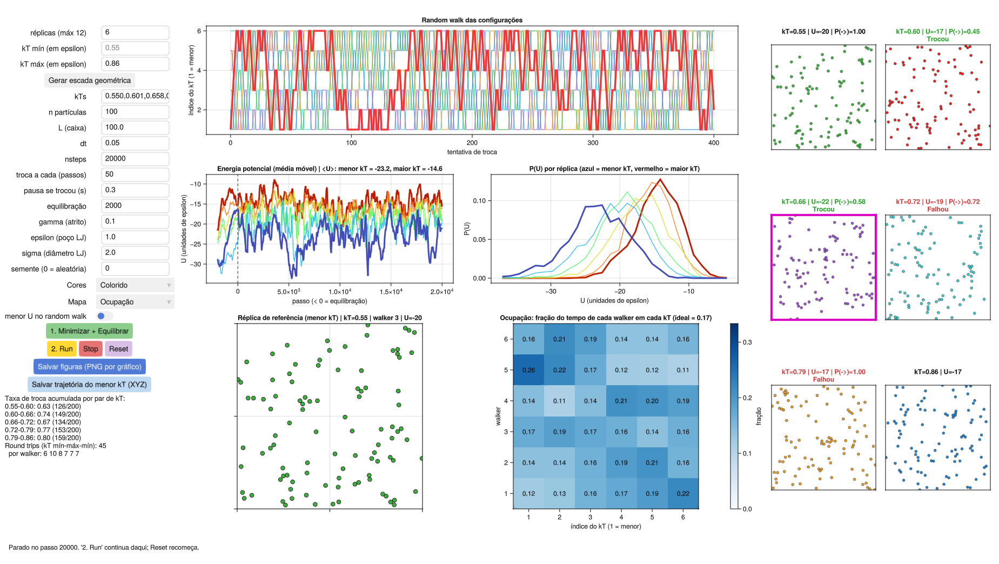
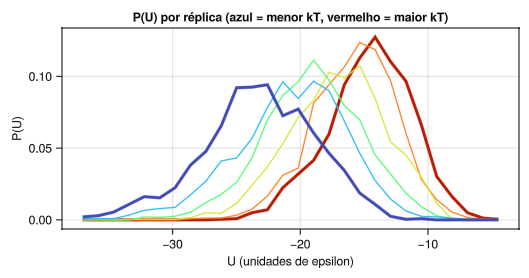
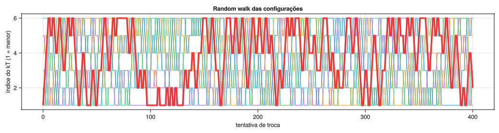
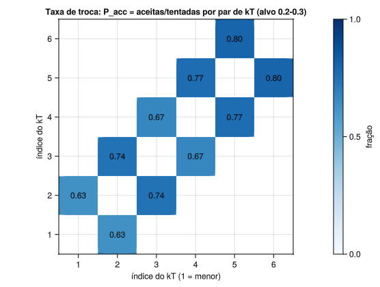
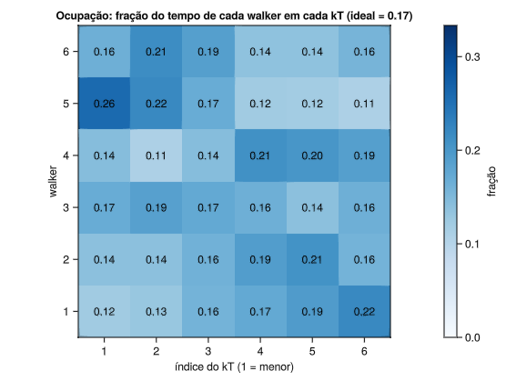
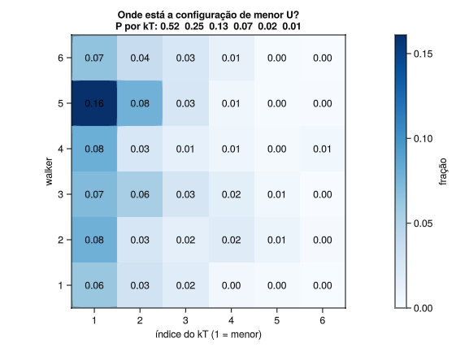
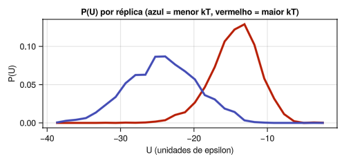
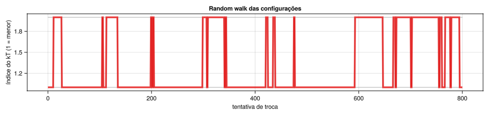

# Tutorial de Replica Exchange MD

Este tutorial apresenta o método de Replica Exchange Molecular Dynamics em temperatura (T-REMD) usando a interface gráfica `remd_gui.jl`. A proposta é variar um parâmetro de cada vez, observar o efeito na amostragem e, a partir disso, discutir como diagnosticar e corrigir problemas.

Os tópicos são:

- o problema que o REMD resolve e o que o método garante;
- os parâmetros de controle e o efeito de cada um;
- como reconhecer, nos gráficos, uma escada de temperaturas adequada;
- o que variar quando a amostragem falha;
- como esses parâmetros aparecem numa simulação molecular.

Pré-requisitos: noções de dinâmica molecular (integração, termostato, energia potencial) e do ensemble canônico. Não é preciso conhecer Julia.

Nos testes da seção 9, os resultados marcados como *observado* foram obtidos em corridas com a GUI. Os marcados como *esperado* são previsões que devem ser conferidas; os valores numéricos variam com a semente e com a duração da corrida.

## Sumário

1. [O problema que o REMD resolve](#1-o-problema-que-o-remd-resolve)
2. [A ideia do método](#2-a-ideia-do-método)
3. [O critério de troca](#3-o-critério-de-troca)
4. [O sistema-modelo da GUI](#4-o-sistema-modelo-da-gui)
5. [Instalação e primeira execução](#5-instalação-e-primeira-execução)
6. [Visita guiada à janela](#6-visita-guiada-à-janela)
7. [Primeira simulação, passo a passo](#7-primeira-simulação-passo-a-passo)
8. [Os parâmetros de controle](#8-os-parâmetros-de-controle)
9. [Testes](#9-testes)
10. [Diagnóstico: do sintoma ao parâmetro](#10-diagnóstico-do-sintoma-ao-parâmetro)
11. [Da GUI para uma simulação molecular](#11-da-gui-para-uma-simulação-molecular)
12. [Salvando figuras e trajetórias](#12-salvando-figuras-e-trajetórias)
13. [Problemas comuns ao usar a GUI](#13-problemas-comuns-ao-usar-a-gui)
14. [Limitações do modelo](#14-limitações-do-modelo)
15. [Glossário](#15-glossário)
16. [Referências](#16-referências)

---

## 1. O problema que o REMD resolve

Uma simulação de dinâmica molecular a temperatura T visita os estados do sistema com probabilidade proporcional a exp(−U/kT). Em princípio, uma trajetória longa o bastante visita tudo o que importa. Na prática, as regiões de baixa energia costumam estar separadas por barreiras, e o tempo médio de espera para cruzar uma barreira de altura ΔU‡ cresce exponencialmente:

```math
\tau \propto \exp\left(\frac{\Delta U^{\ddagger}}{kT}\right)
```

Quando ΔU‡ é muito maior que kT, a simulação fica presa na bacia onde começou. As médias calculadas convergem, mas para a bacia inicial, não para o ensemble. Esse comportamento é chamado de quasi-ergodicidade. Ele é difícil de detectar, porque a própria simulação não indica que há regiões não visitadas.

Aumentar a temperatura resolve a barreira (τ cai exponencialmente), mas então a simulação amostra o ensemble errado: o da temperatura alta. O REMD é uma forma de usar a temperatura alta para cruzar barreiras e, ainda assim, obter o ensemble correto na temperatura baixa.

## 2. A ideia do método

Simulam-se R cópias do mesmo sistema, chamadas **réplicas**, cada uma numa temperatura diferente: T₁ < T₂ < … < T_R. O conjunto das temperaturas é a **escada**.

- A réplica em T₁ é a de interesse (a **réplica de referência**).
- As réplicas em temperaturas altas cruzam barreiras com facilidade.
- De tempos em tempos, duas réplicas de temperaturas vizinhas tentam **trocar de configuração**. Se a troca é aceita, a configuração que estava em T₂ passa a evoluir em T₁, e vice-versa.

Com isso, uma configuração que cruzou uma barreira lá em cima pode descer a escada, degrau por degrau, até chegar a T₁. A réplica de referência recebe configurações de bacias que ela nunca alcançaria sozinha.

**Estado e walker**

| Termo | O que é | Na GUI |
| --- | --- | --- |
| **Estado** | Uma temperatura da escada. É fixo. | Cada painel da direita; o kT no título nunca muda |
| **Walker** (configuração) | Um conjunto de posições e velocidades que passeia pela escada | A cor das partículas |

Quando uma troca é aceita, os dois walkers trocam de painel. As temperaturas dos painéis não mudam; o que muda é a configuração que está em cada uma. É importante manter essa distinção, porque as análises podem ser feitas por estado (o que interessa para as médias) ou por walker (o que interessa para avaliar a mistura).

**O que o método garante**

Se o critério de troca for o correto (seção 3), cada estado continua amostrando exatamente o ensemble canônico da sua temperatura. Nada é forçado nem enviesado. As médias calculadas no estado T₁ são médias canônicas em T₁, sem necessidade de reponderação.

**O que o método não garante**

- Que a réplica mais quente cruze as barreiras. Isso depende de T_R ser alto o suficiente.
- Que as configurações desçam a escada. Isso depende de as trocas serem aceitas em todos os degraus.
- Informação sobre a cinética. As trocas interrompem a dinâmica física: o REMD fornece populações e médias, não tempos nem taxas.

## 3. O critério de troca

### 3.1 A fórmula

Considere dois estados vizinhos i e j, com temperaturas T_i < T_j e β = 1/kT. A configuração que está em i tem energia potencial U_i; a que está em j tem U_j. A troca é aceita com probabilidade

```math
P_{\text{acc}} = \min\left\{1,\ \exp\left[\left(\beta_i - \beta_j\right)\left(U_i - U_j\right)\right]\right\}
```

### 3.2 De onde ela vem

O sistema estendido (todas as réplicas juntas) tem probabilidade conjunta igual ao produto dos fatores de Boltzmann de cada estado. Antes da troca, o peso do par é

```math
w_{\text{antes}} = e^{-\beta_i U_i}\, e^{-\beta_j U_j}
```

Depois da troca, a configuração de energia U_j está em β_i e a de energia U_i está em β_j:

```math
w_{\text{depois}} = e^{-\beta_i U_j}\, e^{-\beta_j U_i}
```

A razão entre os dois é

```math
\frac{w_{\text{depois}}}{w_{\text{antes}}} = \exp\left[\left(\beta_i - \beta_j\right)\left(U_i - U_j\right)\right]
```

Aceitar a troca com probabilidade min{1, razão} é a regra de Metropolis. Ela satisfaz o **balanço detalhado** no espaço estendido, e por isso cada estado continua canônico.

### 3.3 Como ler a fórmula

Como T_i < T_j, o fator (β_i − β_j) é positivo.

- Se U_i > U_j (a configuração no estado frio tem energia **maior** que a do estado quente), o expoente é positivo e a troca é **sempre aceita**. Faz sentido: a configuração de menor energia vai para a temperatura menor.
- Se U_i < U_j (o caso mais comum), a probabilidade cai exponencialmente com a diferença de energia e com a distância entre as temperaturas.

Portanto, só há trocas se as duas réplicas puderem ter energias parecidas, isto é, se as distribuições de energia P(U) dos dois estados se sobrepuserem. Essa relação entre sobreposição e taxa de troca é usada em todo o restante do tutorial.

### 3.4 E a energia cinética?

A fórmula usa só a energia potencial. A energia cinética sai da conta porque, quando a troca é aceita, as velocidades de cada configuração são reescaladas para a nova temperatura:

```math
v_{\text{novo}} = v_{\text{antigo}} \sqrt{\frac{T_{\text{novo}}}{T_{\text{antigo}}}}
```

Com esse reescalonamento, os termos cinéticos se cancelam exatamente na razão de pesos. A GUI faz isso em toda troca aceita.

### 3.5 Quais pares tentam trocar

Só **vizinhos** na escada tentam trocar, porque pares distantes quase nunca teriam sobreposição. Para que todos os pares sejam testados sem que um estado participe de duas trocas ao mesmo tempo, as tentativas alternam entre dois conjuntos:

- rodadas ímpares: pares 1-2, 3-4, 5-6, …
- rodadas pares: pares 2-3, 4-5, …

Cada par é testado uma vez a cada duas rodadas. É o mesmo esquema usado pelo GROMACS.

## 4. O sistema-modelo da GUI

### 4.1 O que é simulado

Partículas idênticas em duas dimensões, numa caixa quadrada com condições periódicas de contorno, interagindo pelo potencial de Lennard-Jones:

```math
U(r) = 4\,\varepsilon\left[\left(\frac{\sigma}{r}\right)^{12} - \left(\frac{\sigma}{r}\right)^{6}\right]
```

- ε (epsilon) é a profundidade do poço: a energia ganha quando duas partículas ficam na distância ideal.
- σ (sigma) é o diâmetro efetivo da partícula. O mínimo do potencial fica em r = 2^(1/6) σ ≈ 1,12 σ.

Não há raio de corte: todos os pares entram na soma, usando a imagem periódica mais próxima (convenção da imagem mínima). Isso torna o cálculo lento para muitas partículas (custo proporcional a n²), mas evita os artefatos de truncamento do potencial na energia usada no critério de troca. Como L é muito maior que σ, a contribuição das demais imagens é desprezível.

### 4.2 Unidades

A GUI usa unidades reduzidas:

| Grandeza | Unidade |
| --- | --- |
| Massa | massa da partícula = 1 |
| Energia | ε (com o padrão ε = 1, os números da tela já estão em unidades de ε) |
| Temperatura | dada como kT, em unidades de energia. kT = 0,5 significa T = 0,5 ε/k_B |
| Comprimento | arbitrária; com o padrão, σ = 2 e L = 100 |
| Tempo | derivada das anteriores: (unidade de comprimento) × √(massa/ε). dt e 1/gamma estão nessa unidade |

Com os valores padrão (n = 100, L = 100, σ = 2), as partículas ocupam cerca de 3 % da área da caixa. O sistema é **diluído**.

### 4.3 Por que esse sistema serve para estudar REMD

O comportamento muda com a temperatura:

- **kT alto**: as partículas se espalham como um gás. A energia potencial fica perto de zero.
- **kT baixo**: as partículas se juntam em aglomerados, e a energia potencial fica bem negativa.

Formar, desfazer e reorganizar aglomerados é um processo lento em kT baixo: para um aglomerado mudar, partículas precisam se soltar, o que custa energia. Esse processo faz o papel que as barreiras conformacionais têm numa molécula. Em kT alto os aglomerados se desfazem com facilidade, e é isso que as réplicas quentes oferecem às frias.

Além disso, a capacidade calorífica do sistema varia com a temperatura (é maior na região onde os aglomerados se formam), o que torna a escolha da escada um problema não trivial, como em sistemas reais.

### 4.4 Como cada réplica é propagada

Cada réplica segue a **dinâmica de Langevin**, integrada com o esquema BAOAB:

```math
m\,\ddot{x} = F(x) - \gamma\, m\, \dot{x} + \sqrt{2\,\gamma\, m\, kT}\;\eta(t)
```

O termo de atrito (γ) e o ruído aleatório (η) juntos funcionam como termostato: mantêm a réplica no ensemble canônico da sua temperatura. O atrito é o campo "gamma (atrito)" da GUI.

As réplicas são independentes entre uma tentativa de troca e a seguinte, e a GUI as propaga em paralelo, uma por thread.

## 5. Instalação e primeira execução

### 5.1 Requisitos

- Julia instalado. Baixe em https://julialang.org/downloads/ ou use o `juliaup`.
- Suporte a OpenGL 3.3 (exigência do pacote gráfico GLMakie). Qualquer computador com placa de vídeo dos últimos anos atende.
- Testado em Ubuntu 20.04.

### 5.2 Baixar

```bash
git clone https://github.com/LP-IQ/remd-tutorial.git
cd remd-tutorial
```

### 5.3 Instalar o pacote gráfico (uma vez)

```bash
julia -e 'using Pkg; Pkg.add("GLMakie")'
```

Isso baixa e compila o GLMakie e suas dependências. Demora alguns minutos.

### 5.4 Abrir a GUI

```bash
julia -t auto remd_gui.jl
```

- `-t auto` faz o Julia usar uma thread por núcleo. Com 6 réplicas, 6 threads já aproveitam todo o paralelismo.
- A primeira abertura é lenta (pode passar de um minuto) porque o Julia compila o código gráfico. As seguintes são mais rápidas.

Alternativa, de dentro do REPL do Julia:

```julia
include("remd_gui.jl")
remd_gui()
```

Se a janela abrir mostrando os painéis com as partículas espalhadas, a instalação está correta.

## 6. Visita guiada à janela

A janela tem três colunas: controles à esquerda, gráficos no centro e réplicas à direita. Há ainda uma linha de mensagens no rodapé.



### 6.1 Coluna da esquerda: controles

**Campos de texto.** Clique no campo, digite o valor e pressione Enter. Use ponto como separador decimal.

| Campo | Padrão | Significado |
| --- | --- | --- |
| réplicas (máx 12) | 6 | Número de temperaturas, usado pelo botão "Gerar escada geométrica" |
| kT mín (em epsilon) | 0,55 | Menor temperatura, usada pelo mesmo botão |
| kT máx (em epsilon) | 0,86 | Maior temperatura, usada pelo mesmo botão |
| kTs | 0.550,0.601,0.658,0.719,0.786,0.860 | A lista de temperaturas que a simulação usa de fato, separadas por vírgula |
| n partículas | 100 | Número de partículas em cada réplica |
| L (caixa) | 100 | Lado da caixa quadrada |
| dt | 0,05 | Passo de integração |
| nsteps | 20000 | Passos executados a cada clique em Run |
| troca a cada (passos) | 50 | Passos de dinâmica entre duas rodadas de tentativas de troca |
| pausa se trocou (s) | 0,3 | Tempo que a tela congela quando uma troca é aceita (só visualização) |
| equilibração | 2000 | Passos sem trocas executados pelo botão 1 |
| gamma (atrito) | 0,1 | Coeficiente de atrito do termostato de Langevin |
| epsilon (poço LJ) | 1,0 | Profundidade do poço de Lennard-Jones |
| sigma (diâmetro LJ) | 2,0 | Diâmetro das partículas |
| semente (0 = aleatória) | 0 | Semente dos números aleatórios |

**Atenção**: os campos "réplicas", "kT mín" e "kT máx" não entram diretamente na simulação. Eles só servem para o botão "Gerar escada geométrica" preencher o campo **kTs**, que é o que vale.

**Quando cada mudança passa a valer**

| Campo alterado | Passa a valer |
| --- | --- |
| kTs, n, L, epsilon, sigma, semente | Só depois de clicar em Reset ou no botão 1 (o sistema é recriado) |
| dt, gamma, nsteps, troca a cada, pausa | No próximo clique em Run |
| equilibração | No próximo clique no botão 1 |

**Menus e chave**

| Controle | Opções | Função |
| --- | --- | --- |
| Teste | "1: referência" a "9: faixa fria" | Preenche os campos com a configuração de um teste da seção 9 (seção 9) |
| Cores | "Destaque (demais em cinza)" / "Colorido" | Como os walkers são pintados (seção 6.4) |
| Mapa | "Ocupação" / "Menor energia" / "Taxa de troca (kT)" / "Trocas entre walkers" | Qual mapa aparece no painel inferior direito do centro (seção 6.3) |
| menor U no random walk | ligado / desligado | Mostra, no random walk, em que kT estava a configuração de menor energia; com a chave ligada, as linhas dos walkers ficam mais claras para destacar esses pontos |

**Botões**

| Botão | O que faz |
| --- | --- |
| Gerar escada geométrica | Preenche kTs com uma progressão geométrica entre kT mín e kT máx |
| 1. Minimizar + Equilibrar | Recria o sistema, minimiza a energia e equilibra cada réplica no seu kT, sem trocas |
| 2. Run | Roda o REMD por nsteps passos. Um novo clique continua de onde parou |
| Stop | Interrompe a equilibração ou a corrida em andamento |
| Reset | Recria o sistema com os valores dos campos. Se houver corrida em andamento, o primeiro clique a interrompe e o segundo recria |
| Salvar figuras (PNG por gráfico) | Grava um PNG de cada gráfico (seção 12) |
| Salvar trajetória do menor kT (XYZ) | Grava a trajetória da réplica de referência (seção 12) |

**Texto de estatísticas.** Abaixo dos botões aparece, durante a corrida:

```
Taxa de troca acumulada por par de kT:
0.55-0.60: 0.61 (122/200)
...
Round trips (kT mín-máx-mín): 42
  por walker: 6 6 6 9 10 5
```

Cada linha de par mostra as duas temperaturas, a fração de trocas aceitas e, entre parênteses, aceitas/tentadas.

### 6.2 Coluna da direita: as réplicas

Um painel por estado, do menor kT (primeiro) ao maior (último). O título de cada um traz:

- `kT=…`: a temperatura do estado (fixa).
- `U=…`: a energia potencial da configuração que está ali agora.
- `P(->)=…`: a probabilidade calculada na última tentativa de troca com o próximo estado.
- `Trocou` em verde ou `Falhou` em vermelho: o resultado da tentativa da rodada mais recente. Como os pares alternam, um estado que não participou dessa rodada fica sem essa indicação.

Um dos painéis tem **moldura magenta grossa**: é o estado que contém, naquele instante, a configuração de menor energia potencial entre todas.

### 6.3 Coluna central: os gráficos

**Random walk das configurações** (topo). Eixo x: número da rodada de tentativas de troca. Eixo y: índice do estado (1 = menor kT). Há uma linha por walker, mostrando em que estado ele estava a cada tentativa. É o gráfico mais importante para julgar a mistura.

**Energia potencial por réplica** (meio, esquerda). Uma curva por estado, de azul (menor kT) a vermelho (maior kT). Mostra a média móvel da energia, para suavizar o ruído.
- Passos negativos são a equilibração; a linha tracejada vertical em 0 marca o início das trocas.
- As curvas dos dois extremos são mais grossas.
- O título mostra a média de U no menor e no maior kT.

**P(U) por réplica** (meio, direita). Um histograma de energia potencial por estado, com as mesmas cores. É acumulado apenas durante o Run. Mostra diretamente a sobreposição que controla a taxa de troca.

**Réplica de referência** (embaixo, esquerda). Uma visão ampliada do estado de menor kT. O título diz qual walker está lá e sua energia.

**Mapa** (embaixo, direita). Um de quatro mapas, conforme o menu "Mapa":

| Mapa | Eixos | Cada célula mostra | Valor ideal |
| --- | --- | --- | --- |
| Ocupação | kT × walker | Fração do tempo que o walker passou naquele kT | 1/R em todas |
| Menor energia | kT × walker | Fração do tempo em que a configuração de menor U estava naquele kT e era aquele walker. O título dá a soma por kT | Concentrado nos kT baixos, espalhado entre walkers |
| Taxa de troca (kT) | kT × kT | Trocas aceitas / tentadas entre dois kT vizinhos | 0,2 a 0,3 |
| Trocas entre walkers | walker × walker | Fração do total de trocas aceitas que ocorreu entre aqueles dois walkers | 1/[R(R−1)/2] em todas |

No mapa "Taxa de troca (kT)", só as células vizinhas à diagonal ficam preenchidas, porque só estados vizinhos tentam trocar.

### 6.4 Cores

- **Destaque (demais em cinza)**: o walker 1 (a configuração que começou no menor kT) é vermelho e os demais são cinza. Serve para seguir uma única configuração pela escada.
- **Colorido**: cada walker tem sua cor. Serve para ver todas as trocas.

No random walk, a linha do walker 1 é sempre mais grossa.

### 6.5 Rodapé

A linha inferior mostra o que a GUI está fazendo ("Minimizando...", "Rodando REMD: passo …"), onde os arquivos foram salvos e as mensagens de erro, que começam com "ERRO:".

## 7. Primeira simulação, passo a passo

O objetivo aqui é só aprender a operar a GUI e a ler a tela. Use os valores abaixo.

**Passo 1. Confira a escada.** Os valores padrão já correspondem ao teste 1:

- réplicas: `6`
- kT mín: `0.55`
- kT máx: `0.86`
- kTs: `0.550,0.601,0.658,0.719,0.786,0.860`

Se tiver alterado algum desses campos, refaça-os e clique em **Gerar escada geométrica**.

**Passo 2. Fixe a semente.** No campo semente, digite `42`. Com a semente fixa, a simulação pode ser repetida.

**Passo 3. Escolha as cores.** No menu Cores, selecione **Colorido**.

**Passo 4. Prepare o sistema.** Clique em **1. Minimizar + Equilibrar**.

O que observar:
- O rodapé mostra "Minimizando..." e depois "Equilibrando cada réplica no seu kT (sem trocas)...".
- Todos os painéis da direita partem da mesma configuração e vão se diferenciando.
- No gráfico de energia, as curvas aparecem em passos negativos e vão se separando: a azul (menor kT) desce mais, a vermelha fica mais alta.
- Ao fim, o rodapé diz "Equilibração concluída. Clique em '2. Run'."

**Passo 5. Rode.** Clique em **2. Run**.

O que observar, na ordem:

1. **Painéis da direita.** A cada 50 passos os títulos ficam verdes ("Trocou") ou vermelhos ("Falhou"). Quando uma troca é aceita, a tela pausa 0,3 s e você vê duas cores trocarem de painel.
2. **Random walk.** As linhas começam separadas, uma em cada nível, e vão se entrelaçando. Acompanhe uma cor: ela deve subir e descer por toda a escada.
3. **P(U).** Os seis histogramas vão se formando. Note que vizinhos se sobrepõem bastante.
4. **Texto de estatísticas.** A taxa de troca de cada par se estabiliza depois de algumas dezenas de tentativas. O contador de round trips começa a subir.
5. **Moldura magenta.** Ela fica quase sempre no primeiro painel, mas às vezes pula para o segundo ou terceiro.

**Passo 6. Explore os mapas.** Com a corrida em andamento ou terminada, troque o menu Mapa entre as quatro opções e leia cada uma com a tabela da seção 6.3.

**Resultado observado nessa configuração**: taxa de troca entre 0,5 e 0,8 em todos os pares, em geral menor no par mais frio, e algumas dezenas de round trips em 20 000 passos (45 em uma das corridas). Os valores mudam com a semente.

**Questões**

1. Por que a moldura magenta às vezes sai do primeiro painel?
   *Resposta*: porque as distribuições P(U) se sobrepõem. De vez em quando, uma réplica mais quente tem energia menor que a de referência. É essa mesma sobreposição que permite as trocas.
2. A taxa de troca está na faixa ideal (0,2 a 0,3)?
   *Resposta*: não, está acima. A escada tem réplicas sobrando para essa faixa de temperatura. O teste 2 trata disso.
3. Por que a taxa de troca é menor nos pares frios?
   *Resposta*: na região fria os aglomerados se formam, a energia varia mais com a temperatura e as distribuições de vizinhos ficam mais afastadas.

## 8. Os parâmetros de controle

Esta seção explica cada parâmetro: o que ele é, como afeta a amostragem e como escolher seu valor.

### 8.1 A escada de temperaturas

A escada é o principal controle do REMD. Ela decide duas coisas independentes:

1. Se as trocas acontecem (espaçamento entre vizinhos).
2. Se as réplicas quentes são quentes o bastante para cruzar barreiras (temperatura máxima).

#### kT mín

É a temperatura que você quer estudar. Não é um parâmetro de ajuste; vem da pergunta física. Quanto mais baixo, mais o sistema fica preso e mais o REMD tem a oferecer, mas também mais larga fica a faixa a cobrir.

#### kT máx

É a temperatura do topo da escada. Precisa ser alta o bastante para o sistema "esquecer" rapidamente onde estava: na GUI, para que os aglomerados se desfaçam e se refaçam em poucos passos.

| Se kT máx for… | Consequência |
| --- | --- |
| Baixo demais | As trocas funcionam e o random walk parece adequado, mas nenhuma réplica cruza as barreiras. A amostragem em kT mín não melhora, embora os indicadores de mistura sejam bons |
| Alto demais | A faixa a cobrir cresce, e são necessárias mais réplicas para manter as trocas. Custo desperdiçado |

Como escolher: olhe o painel do maior kT. Se ali as partículas estão espalhadas e os aglomerados não persistem, o topo cumpre sua função.

#### Número de réplicas e espaçamento

Com a faixa fixa, mais réplicas significam vizinhos mais próximos, mais sobreposição de P(U) e taxa de troca maior. Mas cada réplica custa uma simulação inteira, e um walker tem mais degraus a percorrer.

**Por que o espaçamento certo depende do tamanho do sistema.** Para dois estados vizinhos separados por ΔT:

- A distância entre as energias médias é ΔU ≈ C·ΔT, onde C é a capacidade calorífica. C é proporcional ao número de partículas n.
- A largura de cada distribuição é σ_U = T·√(k·C), proporcional a √n.

A sobreposição depende da razão entre as duas:

```math
\frac{\Delta U}{\sigma_U} \approx \sqrt{\frac{C}{k}}\;\frac{\Delta T}{T} \;\propto\; \sqrt{n}\;\frac{\Delta T}{T}
```

Duas conclusões saem daí:

1. Para manter a mesma sobreposição em toda a escada, ΔT/T deve ser constante. Isso é uma **progressão geométrica** de temperaturas.
2. Para manter a sobreposição quando o sistema cresce, ΔT/T deve encolher como 1/√n. O número de réplicas necessário para cobrir uma faixa cresce com **√n**.

A segunda conclusão é a razão pela qual o T-REMD fica caro em sistemas grandes, como proteínas em água explícita (seção 11).

#### O campo kTs e a escada geométrica

O botão "Gerar escada geométrica" calcula

```math
kT_i = kT_{\min}\left(\frac{kT_{\max}}{kT_{\min}}\right)^{\frac{i-1}{R-1}}, \qquad i = 1, \dots, R
```

A progressão geométrica dá taxa de troca uniforme **se a capacidade calorífica for constante** ao longo da escada. Neste sistema ela não é: na região onde os aglomerados se formam, a energia varia muito com a temperatura, e os pares dessa região aceitam menos.

Quando a taxa de troca não é uniforme, edite o campo kTs à mão: aproxime as temperaturas onde a taxa é baixa e afaste onde é alta. Depois clique no botão 1 para aplicar.

#### Como julgar a escada

| Taxa de troca por par | Interpretação |
| --- | --- |
| Abaixo de 0,1 | Gargalo. Os walkers praticamente não atravessam esse degrau |
| 0,2 a 0,3 | Faixa-alvo usual. Até 0,4 é aceitável |
| Acima de 0,5 ou 0,6 em todos os pares | Réplicas sobrando. Dá para remover algumas ou aumentar kT máx |

O ideal é que a taxa seja **parecida em todos os pares**. Um único par ruim limita toda a escada.

### 8.2 Tamanho e densidade do sistema

#### n partículas

É o parâmetro do sistema que mais afeta o REMD, pelo argumento da seção 8.1: com mais partículas, as distribuições de energia de vizinhos se afastam mais rápido do que se alargam, e a taxa de troca cai para a mesma escada. Dobrar n pede cerca de √2 vezes mais réplicas.

O custo computacional por passo na GUI cresce com n², porque todos os pares são calculados.

#### L (caixa)

Define, com n, a densidade n/L². Uma caixa menor aumenta a densidade, torna a energia mais negativa em todas as temperaturas e desloca para kT mais alto a região onde os aglomerados se formam. Se você mudar L, a escada que funcionava pode deixar de funcionar.

#### epsilon e sigma

- **epsilon**: o que importa é a razão kT/epsilon. Dobrar epsilon equivale a dividir por dois todas as temperaturas da escada.
- **sigma**: define o tamanho das partículas e, com n e L, a fração da caixa ocupada.

Em geral não há motivo para alterar esses dois no tutorial.

### 8.3 Integração e termostato

#### dt

O passo de integração. Um dt maior cobre mais tempo por passo, mas acima de um limite a integração fica instável e a energia dispara.

No REMD há um cuidado adicional: **o limite de dt é imposto pela réplica mais quente**, onde as partículas são mais rápidas e as colisões mais violentas. Um dt adequado para kT mín pode ser instável em kT máx. Se a energia de um painel quente disparar, reduza dt.

Observado: dt = 0,05 foi estável até kT = 0,86. Acima disso, confira.

#### gamma (atrito)

O coeficiente de atrito do termostato de Langevin. O tempo de relaxação da temperatura é da ordem de 1/gamma.

| gamma | Comportamento |
| --- | --- |
| Pequeno (0,01) | Dinâmica quase newtoniana; a temperatura demora a se ajustar |
| Padrão (0,1) | Relaxação em 1/0,1 = 10 unidades de tempo, ou 200 passos com dt = 0,05 |
| Grande (1 ou mais) | A temperatura se ajusta rápido, mas o movimento fica difusivo e o sistema explora o espaço mais devagar |

No REMD, gamma importa logo depois de uma troca: o walker chega a uma temperatura nova com as velocidades já reescaladas, mas com posições ainda típicas da temperatura anterior. Ele precisa de um tempo da ordem de 1/gamma para relaxar.

### 8.4 Frequência de troca

O campo "troca a cada (passos)" é o número de passos de dinâmica entre duas rodadas de tentativas.

| Intervalo | Efeito |
| --- | --- |
| Pequeno | Mais tentativas por tempo simulado; os walkers percorrem a escada mais rápido |
| Grande | Cada réplica tem mais tempo para explorar na temperatura nova antes da próxima tentativa, mas a escada é percorrida devagar |

Dois fatos úteis:

- Tentar com mais frequência **não viola** o balanço detalhado. Cada estado continua canônico.
- A taxa de troca (fração aceita) quase não depende do intervalo. O que muda é o **número** de trocas por tempo simulado, e portanto o número de round trips.

Na literatura, a recomendação geral é trocar com frequência (Sindhikara et al., 2008). O padrão da GUI, 50 passos, é menor que o tempo de relaxação do termostato (cerca de 200 passos).

O campo "pausa se trocou" não altera a simulação; só congela a tela para que as trocas sejam visíveis. Use 0 para rodar na velocidade máxima.

### 8.5 Preparação: minimização e equilibração

O botão 1 faz três coisas:

1. **Recria o sistema** com posições sorteadas. Partículas podem estar sobrepostas, com energia enorme.
2. **Minimiza**: desloca as partículas na direção das forças, em passos pequenos, até remover as sobreposições. Sem isso, o primeiro passo de dinâmica explodiria.
3. **Equilibra**: copia a configuração minimizada para todas as réplicas, sorteia velocidades na temperatura de cada uma e roda a dinâmica **sem trocas** pelo número de passos do campo "equilibração".

Por que equilibrar sem trocas: todas as réplicas partem da mesma configuração, então no início nenhuma está em equilíbrio com seu kT. Se as trocas começassem imediatamente, as primeiras refletiriam essa relaxação e não o comportamento da escada.

Como saber se a equilibração bastou: no gráfico de energia, as curvas (em passos negativos) devem ter parado de derivar e estar separadas por temperatura quando chegam à linha tracejada. As réplicas frias são as que demoram mais, porque formar aglomerados é lento. Se a curva azul ainda estiver caindo no passo 0, aumente o número de passos de equilibração.

### 8.6 Duração da corrida

"nsteps" é o número de passos por clique em Run. Novos cliques acumulam estatística.

A duração não deve ser julgada pelo número de passos, e sim pelo número de **round trips**: quantas vezes cada walker foi do menor ao maior kT e voltou. Cada round trip é, grosso modo, uma oportunidade de entregar uma configuração nova e descorrelacionada à réplica de referência. Com poucos round trips, as médias em kT mín ainda dependem de onde o sistema começou.

A GUI conta um round trip quando um walker que já tocou o maior kT volta ao menor.

### 8.7 Semente

Define as posições iniciais, as velocidades, o ruído do termostato e os sorteios das trocas.

- `0`: uma semente nova é sorteada a cada Reset. Use para ver a variabilidade entre corridas.
- Qualquer outro valor: a simulação é repetível.

Para comparar dois valores de um parâmetro de forma justa, use a mesma semente nos dois.

## 9. Testes

Cada teste muda **um** parâmetro em relação à referência. Para todos:

- Selecione o teste no menu **Teste**. Ele preenche todos os campos com os valores abaixo, incluindo semente `42` e pausa `0`, mas não inicia a simulação. Os testes com variantes aparecem separados no menu (por exemplo, "2a: 3 réplicas" e "2b: 2 réplicas"). O teste 5 não tem entrada própria: parte da configuração "4a" com a lista kTs editada à mão.
- Use cores "Colorido".
- Clique em **1. Minimizar + Equilibrar** e então em **2. Run**.
- Ao fim, clique em **Salvar figuras** e anote a taxa de troca por par e os round trips.

Uma tabela para anotar os resultados:

| Teste | Réplicas | kT mín–máx | n | Troca a cada | Taxa de troca (mín–máx) | Round trips | Observações |
| --- | --- | --- | --- | --- | --- | --- | --- |
| 1 | 6 | 0,55–0,86 | 100 | 50 | | | |
| 2 | 3 | 0,55–0,86 | 100 | 50 | | | |
| … | | | | | | | |

### Teste 1: referência

**Objetivo**: ter uma corrida de comparação e aprender a ler os painéis.

**Configuração**: réplicas 6, kT de 0,55 a 0,86 em escada geométrica; demais campos no padrão; nsteps 20000.

**O que olhar**
- Random walk: todas as cores percorrem os seis níveis?
- P(U): quanto os histogramas vizinhos se sobrepõem?
- Mapa "Ocupação": as células estão perto de 1/6 ≈ 0,17?
- Mapa "Taxa de troca (kT)": qual par tem a menor taxa?

**Observado** (uma corrida de 20 000 passos): taxa de troca de 0,63 a 0,80, com o menor valor no par mais frio; 45 round trips; ocupação entre 0,11 e 0,26, em torno do ideal de 0,17.





| Taxa de troca | Ocupação | Menor energia |
| --- | --- | --- |
|  |  |  |

A configuração de menor energia esteve no menor kT em 52 % do tempo, no segundo estado em 25 % e nos demais no restante, o que reflete a sobreposição das P(U).

**Conclusão**: a escada mistura bem, mas está mais densa do que o necessário.

### Teste 2: menos réplicas na mesma faixa

**Objetivo**: ver que o espaçamento controla a taxa de troca.

**Configuração**: como o teste 1, mas com réplicas 3 (clique em "Gerar escada geométrica" de novo). Repita com réplicas 2.

**Esperado com 3 réplicas**: histogramas P(U) de vizinhos menos sobrepostos e taxa de troca menor em todos os pares.

**Observado com 2 réplicas**: os dois histogramas ficam bem separados e só se cruzam numa faixa estreita de energia; o random walk mostra longos trechos sem troca, intercalados com sequências curtas de trocas.





**Pergunta**: qual número de réplicas coloca a taxa de troca perto de 0,2 a 0,3 nessa faixa?

### Teste 3: faixa larga com poucas réplicas

**Objetivo**: ver o caso em que o REMD degenera em simulações independentes.

**Configuração**: réplicas 3, kT mín 0.35, kT máx 1.2. Aumente a equilibração para 5000.

**Esperado**
- Histogramas P(U) separados, sem sobreposição.
- Taxa de troca perto de zero.
- Random walk com linhas horizontais: cada walker fica no nível onde começou.
- Mapa "Ocupação" diagonal: cada walker em um só kT.
- Zero round trips.

**Cuidado**: com kT máx 1.2, confira se a energia do painel mais quente não dispara. Se disparar, reduza dt para 0.02.

**Conclusão**: sem sobreposição de energia não há troca, e as R simulações não se ajudam.

### Teste 4: a mesma faixa com mais réplicas

**Objetivo**: recuperar as trocas adicionando réplicas.

**Configuração**: como o teste 3, com réplicas 8; depois 10.

**Esperado**
- As trocas voltam.
- A taxa de troca não é uniforme: os pares da região fria aceitam menos que os da região quente.
- O random walk mostra walkers que circulam bem na parte de cima da escada e têm dificuldade na parte de baixo.

**Pergunta**: qual par é o gargalo? Use o mapa "Taxa de troca (kT)".

### Teste 5: escada ajustada à mão

**Objetivo**: uniformizar a taxa de troca sem aumentar o número de réplicas.

**Configuração**: parta da escada do teste 4. Edite o campo kTs: aproxime as temperaturas na região onde a taxa era baixa e afaste-as onde era alta, mantendo o primeiro e o último valores. Clique no botão 1 e rode.

**Esperado**: taxa de troca mais uniforme e mais round trips com o mesmo custo.

**Procedimento**: rodar, identificar o par com a menor taxa, aproximar as duas temperaturas desse par e repetir. Métodos sistemáticos para otimizar a escada são descritos na literatura (por exemplo, Katzgraber et al., 2006).

### Teste 6: frequência de troca

**Objetivo**: ver que a frequência de tentativas controla a velocidade do random walk.

**Configuração**: na escada do teste 1 (ou 5), rode três vezes, com "troca a cada" igual a 10, 50 e 500, sempre com nsteps 20000.

**Esperado**
- A taxa de troca (fração aceita) fica parecida nos três casos.
- O número de rodadas de tentativas é 2000, 400 e 40, respectivamente (cada par é testado em metade delas).
- O número de round trips cai fortemente com o intervalo maior.

**Conclusão**: para o mesmo custo, trocar com mais frequência entrega mais configurações à réplica de referência.

### Teste 7: tamanho do sistema

**Objetivo**: ver a dependência com √n.

**Configuração**: na escada do teste 1, mude n para 200 e L para 141 (mantém a densidade). Depois n 400 e L 200. A simulação fica mais lenta.

**Esperado**
- A taxa de troca cai em todos os pares quando n aumenta.
- Os histogramas P(U) ficam mais estreitos em relação à distância entre eles.

**Pergunta**: quantas réplicas seriam necessárias para n = 400 ter a mesma taxa de troca que n = 100 tinha com 6? *Estimativa*: √4 = 2 vezes mais intervalos, ou seja, cerca de 11 réplicas.

### Teste 8: gargalo no meio da escada

**Objetivo**: reconhecer um gargalo pelos mapas.

**Configuração**: digite no campo kTs a lista `0.55,0.58,0.61,0.80,0.83,0.86` e clique no botão 1.

**Esperado**
- Taxa de troca alta nos pares 1-2, 2-3, 4-5 e 5-6, e baixa no par 3-4.
- Random walk: os walkers formam dois grupos que raramente se misturam.
- Mapa "Ocupação": dois blocos.
- Mapa "Trocas entre walkers": dois blocos de trocas frequentes, com poucas trocas entre os blocos.
- Poucos round trips.

Se o par 3-4 ainda trocar bastante, aumente o buraco (por exemplo, 0.55, 0.57, 0.59, 0.95, 0.98, 1.01).

**Conclusão**: a taxa de troca média pode parecer boa enquanto um único par impede a circulação. Olhe sempre o par pior e os round trips.

### Teste 9: o topo da escada é quente o bastante?

**Objetivo**: ver que boa mistura não basta.

**Configuração**: réplicas 6, kT mín 0.35, kT máx 0.45 (faixa estreita e fria). Aumente a equilibração para 5000.

**Esperado**
- Taxa de troca alta e muitos round trips: todos os indicadores de mistura parecem ótimos.
- Mas no painel do maior kT os aglomerados persistem: o topo não é quente o bastante para desfazê-los.
- As configurações que chegam à réplica de referência são parecidas com as que já estavam lá.

**Conclusão**: a avaliação tem duas etapas. A primeira é verificar se a escada mistura. A segunda é verificar se a temperatura máxima é suficiente para descorrelacionar o grau de liberdade lento. A taxa de troca e os round trips respondem apenas à primeira.

## 10. Diagnóstico: do sintoma ao parâmetro

As tabelas abaixo relacionam cada sintoma ao parâmetro que deve ser alterado. A ordem sugerida é: preparação, mistura na escada e temperatura máxima.

**Etapa 1: a preparação está correta?**

| Sintoma | Onde aparece | O que variar |
| --- | --- | --- |
| Curvas de energia ainda derivando no passo 0 | Gráfico de energia, parte negativa | Aumentar a equilibração |
| Taxa de troca muda muito no início da corrida | Texto de estatísticas | Mesmo; descartar o início |

**Etapa 2: a escada mistura?**

| Sintoma | Onde aparece na GUI | Causa provável | O que variar |
| --- | --- | --- | --- |
| Taxa de troca perto de zero em um par | Texto de estatísticas; mapa "Taxa de troca (kT)"; histogramas P(U) separados | Vizinhos distantes demais | Adicionar uma réplica nesse intervalo ou aproximar os kTs |
| Taxa de troca acima de 0,5 em todos os pares | Mesmos lugares; P(U) quase coincidentes | Réplicas sobrando | Remover réplicas ou aumentar kT máx |
| Taxa de troca desigual entre pares | Mapa "Taxa de troca (kT)" | Capacidade calorífica varia na escada | Editar kTs: aproximar onde a taxa é baixa |
| Walkers em grupos isolados | Mapa "Trocas entre walkers" e "Ocupação" em blocos; random walk em faixas | Gargalo em um par | Corrigir esse par (primeira linha) |
| Poucos round trips com taxa de troca razoável | Contador de round trips; random walk lento | Poucas tentativas, ou réplicas demais para percorrer | Diminuir "troca a cada"; rodar mais; reduzir réplicas se a taxa permitir |
| Round trips muito desiguais entre walkers | "por walker" no texto de estatísticas | Corrida curta, ou um walker preso | Rodar mais; conferir equilibração |

**Etapa 3: a temperatura máxima é suficiente?**

| Sintoma | Onde aparece | Causa provável | O que variar |
| --- | --- | --- | --- |
| Mistura boa, mas a réplica de referência não muda | Painel do maior kT com aglomerados persistentes | kT máx baixo demais | Aumentar kT máx (e réplicas, para manter a taxa) |
| Energia de um painel quente dispara | Título do painel; gráfico de energia | dt grande demais para a réplica quente | Reduzir dt |

## 11. Da GUI para uma simulação molecular

Os parâmetros da GUI têm equivalentes diretos em pacotes de dinâmica molecular. A tabela usa o GROMACS como exemplo.

| Na GUI | Em simulação molecular | No GROMACS |
| --- | --- | --- |
| kTs | Temperatura de cada réplica | `ref-t` diferente no `.mdp` de cada diretório |
| troca a cada (passos) | Intervalo entre tentativas | `mdrun -replex N` |
| Execução em paralelo das réplicas | Uma simulação por réplica, sincronizadas | `mpirun -np R gmx_mpi mdrun -multidir …` |
| gamma (atrito) | Acoplamento do termostato | `tau-t` (com o integrador `sd`, o atrito é 1/`tau-t`) |
| equilibração | Equilibrar cada réplica na sua temperatura antes das trocas | NVT/NPT por réplica |
| n partículas | Número total de átomos, **incluindo o solvente** | — |
| Random walk dos walkers | Índices de réplica ao longo do tempo | Linhas "Repl ex" do log; script `demux.pl` (no diretório `scripts/` do código-fonte) com `gmx trjcat -demux` |
| Trajetória do menor kT | Trajetória do diretório de menor temperatura | Arquivo `.xtc` desse diretório, contínuo no estado |

**O custo do solvente.** Pelo argumento da seção 8.1, o número de réplicas cresce com √n, e n inclui todos os átomos. Num peptídeo solvatado, a maior parte dos átomos é água, e é ela que limita o espaçamento entre temperaturas. Por isso o T-REMD em solvente explícito exige muitas réplicas mesmo para solutos pequenos.

**A saída: REST2.** No *Replica Exchange with Solute Tempering* (Wang, Friesner e Berne, 2011), todas as réplicas ficam na mesma temperatura, e o que varia é o Hamiltoniano: só as interações do soluto são escaladas, como se apenas ele fosse aquecido. A diferença de energia entre réplicas passa a vir só dos átomos do soluto, e poucas réplicas bastam. Os conceitos deste tutorial (sobreposição, taxa de troca, round trips, gargalo, topo quente o bastante) valem igualmente; muda apenas o que é a "escada".

**Outros cuidados em simulações reais**

- Em NPT, o critério de troca ganha um termo com pressão e volume. Muitos protocolos usam NVT na produção por simplicidade.
- A trajetória de cada diretório é contínua no estado, não na configuração. Para acompanhar uma configuração (por exemplo, para calcular RMSD ao longo do tempo), é preciso demultiplexar.
- Apenas o estado de interesse dá diretamente o ensemble físico. Usar os demais exige reponderação (WHAM, MBAR).

## 12. Salvando figuras e trajetórias

### 12.1 Figuras

O botão **Salvar figuras (PNG por gráfico)** cria, no diretório de onde o Julia foi iniciado, uma pasta com nome do tipo

```
remd_figs_R6_kT0.55-0.86_n100_troca50_passo20000/
```

contendo:

| Arquivo | Conteúdo |
| --- | --- |
| `random_walk.png` | Random walk das configurações |
| `energia.png` | Energia potencial por réplica |
| `P_U.png` | Histogramas P(U) |
| `replica_referencia.png` | Réplica de referência |
| `replicas.png` | Todos os painéis de réplicas |
| `mapa_ocupacao.png` | Mapa de ocupação |
| `mapa_menor_energia.png` | Mapa da menor energia |
| `mapa_taxa_de_troca.png` | Mapa da taxa de troca |
| `mapa_trocas_walkers.png` | Mapa de trocas entre walkers |
| `janela_completa.png` | A janela inteira |

Os quatro mapas são salvos independentemente de qual está selecionado. A resolução é a da janela; maximize-a antes de salvar para obter figuras maiores.

### 12.2 Trajetória

O botão **Salvar trajetória do menor kT (XYZ)** grava dois arquivos:

- `remd_traj_….xyz`: um frame a cada 10 passos do Run, sempre do estado de menor kT. A equilibração não entra. A linha de comentário de cada frame traz o passo, o walker que estava ali, a energia, o kT e L.
- `remd_traj_….tcl`: um script para o VMD que carrega a trajetória com a representação correta.

Para visualizar:

```bash
vmd -e remd_traj_….tcl
```

Abrir o `.xyz` diretamente também funciona; nesse caso, em Graphics → Representations, troque o Drawing Method para VDW.

**Como interpretar a trajetória.** Ela é contínua no **estado**: mostra sempre o que estava em kT mín. A cada troca aceita no par mais frio, as posições saltam, porque outra configuração assumiu o lugar. Esses saltos são esperados. As médias calculadas sobre essa trajetória são médias canônicas em kT mín.

Reset ou uma nova equilibração apagam os frames acumulados. O limite é de 50 000 frames.

## 13. Problemas comuns ao usar a GUI

| Problema | Causa e solução |
| --- | --- |
| A janela demora muito a abrir na primeira vez | Normal: o Julia está compilando o GLMakie. As próximas aberturas são mais rápidas |
| Mudei kTs (ou n, L) e nada mudou | Esses campos só valem depois de Reset ou do botão 1 |
| Digitei um valor e ele não foi aceito | Pressione Enter depois de digitar. Use ponto como separador decimal |
| "ERRO: minimize e equilibre primeiro (botão 1)" | Clique no botão 1 antes de Run |
| "Já há uma simulação em andamento. Use Stop antes." | Clique em Stop e espere a mensagem "Parado no passo …" |
| A energia de um painel vai para valores enormes | dt grande demais para aquela temperatura. Reduza dt e refaça a partir do botão 1 |
| A simulação está muito lenta | Coloque 0 em "pausa se trocou"; reduza n; confira se abriu com `-t auto` |
| Parte da janela fica cortada | Maximize ou redimensione a janela; os gráficos acompanham |
| O número de round trips é zero | A corrida é curta, ou há um gargalo. Veja o mapa "Taxa de troca (kT)" |

## 14. Limitações do modelo

- **É um modelo didático.** Um gás de Lennard-Jones diluído em 2D não tem barreiras tão altas quanto as de uma biomolécula, e o ganho de amostragem com o REMD é menor do que em sistemas reais.
- **A GUI mostra a mecânica do método, não o ganho final.** Os painéis diagnosticam a mistura na escada. Não há, na versão atual, um observável estrutural comparando a réplica de referência com e sem trocas.
- **Custo O(n²).** Sem raio de corte nem lista de vizinhos, sistemas com mais de algumas centenas de partículas ficam lentos.
- **Estatística curta.** Corridas de 20 000 passos dão algumas centenas de tentativas por par. As taxas de troca têm incerteza de alguns centésimos, e os mapas por walker têm mais ruído ainda. Diferenças pequenas entre corridas podem ser apenas flutuação; repita com outra semente antes de concluir.
- **Só T-REMD.** Variantes como REST2 e REMD em Hamiltoniano não estão implementadas.

## 15. Glossário

| Termo | Significado |
| --- | --- |
| Réplica | Uma das cópias do sistema simuladas em paralelo |
| Estado | Uma temperatura da escada; fixo |
| Walker | Uma configuração (posições e velocidades) que migra entre estados |
| Escada | O conjunto das temperaturas |
| Réplica de referência | O estado de menor kT, o de interesse |
| Taxa de troca (P_acc) | Fração das tentativas de troca aceitas em um par de estados vizinhos; também chamada de taxa de aceitação |
| P(U) | Distribuição da energia potencial em um estado |
| Sobreposição | Região de energias que dois estados vizinhos visitam em comum |
| Random walk | O passeio de um walker pelos estados ao longo das trocas |
| Round trip | Ida de um walker do menor ao maior kT e volta |
| Ocupação | Fração do tempo que um walker passa em cada estado |
| Gargalo | Par de estados com taxa de troca muito baixa, que divide a escada |
| Balanço detalhado | Condição que garante que o critério de troca preserva o ensemble de cada estado |
| Quasi-ergodicidade | Situação em que a simulação fica presa numa região e não amostra o ensemble completo |
| Demultiplexar | Reconstruir a trajetória contínua de cada walker a partir das trajetórias por estado |
| REST2 | Variante em que só as interações do soluto são escaladas, reduzindo o número de réplicas |

## 16. Referências

**O método**
- Hukushima, K.; Nemoto, K. Exchange Monte Carlo method and application to spin glass simulations. *J. Phys. Soc. Jpn.* **65**, 1604 (1996). doi:10.1143/JPSJ.65.1604
- Sugita, Y.; Okamoto, Y. Replica-exchange molecular dynamics method for protein folding. *Chem. Phys. Lett.* **314**, 141 (1999). doi:10.1016/S0009-2614(99)01123-9
- Earl, D. J.; Deem, M. W. Parallel tempering: theory, applications, and new perspectives. *Phys. Chem. Chem. Phys.* **7**, 3910 (2005). doi:10.1039/B509983H

**Escolha da escada e taxa de troca**
- Kofke, D. A. On the acceptance probability of replica-exchange Monte Carlo trials. *J. Chem. Phys.* **117**, 6911 (2002). doi:10.1063/1.1507776. Errata: *J. Chem. Phys.* **120**, 10852 (2004).
- Rathore, N.; Chopra, M.; de Pablo, J. J. Optimal allocation of replicas in parallel tempering simulations. *J. Chem. Phys.* **122**, 024111 (2005). doi:10.1063/1.1831273
- Katzgraber, H. G.; Trebst, S.; Huse, D. A.; Troyer, M. Feedback-optimized parallel tempering Monte Carlo. *J. Stat. Mech.: Theory Exp.* (2006) P03018. doi:10.1088/1742-5468/2006/03/P03018
- Patriksson, A.; van der Spoel, D. A temperature predictor for parallel tempering simulations. *Phys. Chem. Chem. Phys.* **10**, 2073 (2008). doi:10.1039/B716554D

**Frequência de troca**
- Sindhikara, D.; Meng, Y.; Roitberg, A. E. Exchange frequency in replica exchange molecular dynamics. *J. Chem. Phys.* **128**, 024103 (2008). doi:10.1063/1.2816560

**Variantes**
- Wang, L.; Friesner, R. A.; Berne, B. J. Replica exchange with solute scaling: a more efficient version of replica exchange with solute tempering (REST2). *J. Phys. Chem. B* **115**, 9431 (2011). doi:10.1021/jp204407d

**Integrador**
- Leimkuhler, B.; Matthews, C. Rational construction of stochastic numerical methods for molecular sampling. *Appl. Math. Res. eXpress* **2013**, 34–56 (2013). doi:10.1093/amrx/abs010

**Material relacionado**
- Martínez, L. FundamentosDMC.jl: material didático sobre simulações de dinâmica molecular, que inspirou a interface. https://github.com/m3g/FundamentosDMC.jl
